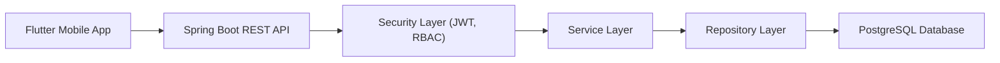

# Vortex Synergy College Project Pack

## Project Title

Vortex Synergy - A Secure and Fair Resource Distribution Platform for Zero Hunger and Good Health

## Abstract

Vortex Synergy is a mobile-first platform designed to support Sustainable Development Goal 2 (Zero Hunger) and Sustainable Development Goal 3 (Good Health and Well-Being). The system connects donors, receiver organizations, doctor or pharmacist verifiers, and administrators to distribute food and medicine in a controlled, transparent, and safe manner. The application enables secure authentication, role-based access control, resource listing, medicine verification, fair claim handling, delivery coordination, notifications, reporting, and audit history. The platform focuses on reducing waste, preventing misuse of medicines, and improving accountability in the distribution of essential resources.

## Problem Statement

Many communities face shortages of food and essential medicines, while usable resources are often wasted because there is no structured, transparent, and safe platform connecting donors and verified receivers. Existing informal processes also create risks such as unfair allocation, unverified medicine distribution, poor traceability, and weak coordination during pickup and delivery.

## Objectives

- Build a secure application for food and medicine distribution.
- Ensure medicine listings are reviewed before public availability.
- Support fair and transparent resource claims.
- Provide delivery coordination with donor-side pickup approval.
- Maintain auditability through notifications, timelines, and reports.
- Align the solution with SDG 2 and SDG 3.

## Core Modules

- Authentication and role-based access control
- Donor resource creation and tracking
- Receiver resource discovery and claiming
- Doctor or pharmacist medicine verification
- Receiver-managed delivery assignment and tracking
- Donor pickup approval
- Notification center
- Audit timeline and reporting
- Admin verification, moderation, and analytics

## Technology Stack

- Frontend: Flutter
- Backend: Spring Boot (Java)
- Database: PostgreSQL
- Authentication: JWT
- Password Security: BCrypt

## Key Features Implemented

- User registration, login, JWT auth, role-based access
- Food and medicine listing with photos and structured location
- Doctor or pharmacist approval workflow for medicines
- Claim reservation, confirmation, cancellation, and handover
- Receiver-managed delivery assignment
- Donor-side pickup approval
- Delivery state tracking
- Notifications for claim and delivery events
- Audit timelines for resources and claims
- CSV export reports
- Admin moderation and analytics

## System Architecture

## High-Level Workflow

1. Donor logs in and adds a food or medicine resource.
2. Food becomes visible if valid; medicine stays pending until medically approved.
3. Receiver browses available resources and requests a claim.
4. Receiver confirms the claim and assigns delivery details if delivery is needed.
5. Donor approves pickup when the assigned agent arrives.
6. Receiver updates delivery progress until completion.
7. Notifications, reports, and audit logs capture the full history.

## Database Entities

- `users`
- `resources`
- `claims`
- `deliveries`
- `verifications`
- `notifications`
- `audit_logs`

## Innovation / Project Value

- SDG-focused social impact use case
- Safe medicine compliance workflow
- Explainable priority support for claims
- Delivery accountability through donor approval
- Audit and reporting support for operational transparency

## Limitations

- Placeholder email and phone verification
- In-app notifications only, no production push notifications
- No live map SDK integration
- CSV export only, no PDF export
- Limited automated test coverage

## Future Scope

- Real OTP or KYC verification
- Push notifications
- NGO-specific organization accounts and approval chains
- Advanced analytics dashboard
- Cloud deployment and observability
- Real map and route tracking support

## Demo Flow Recommendation

Use this order during presentation:

1. Login as donor and create a food resource.
2. Show that the food appears for the receiver.
3. Login as donor and create a medicine resource.
4. Login as doctor or pharmacist and approve the medicine.
5. Login as receiver and claim the approved resource.
6. Assign delivery agent details from the receiver side.
7. Login as donor and approve pickup.
8. Return to receiver and mark delivery in transit and delivered.
9. Show notifications, timeline, and CSV report preview.
10. Show admin moderation and analytics.

## Submission Notes

- Keep the live demo focused on one complete flow.
- Mention V1 and V2 progression to show iterative development.
- Be explicit that medicine visibility is gated by medical approval.
- Highlight security, fairness, and auditability as the main differentiators.
